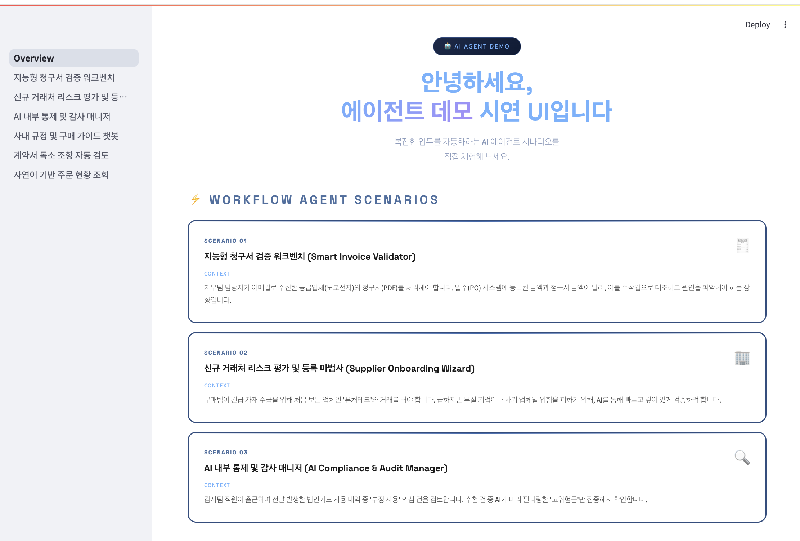

# CTC Demo Agent Streamlit


[](https://share.streamlit.io/randyzwitch/streamlit-folium/examples/Overview.py)

streamlit-folium integrates two great open-source projects in the Python ecosystem: [Streamlit](https://streamlit.io/) and [Folium](https://python-visualization.github.io/folium/)!

## Installation

```python
pip install streamlit
```

## Usage (local)

```python
streamlit run Overview.py
```

- http://localhost:8501/ 접속


## Example



## Contributing

See [CONTRIBUTING.md](CONTRIBUTING.md) for more details.
